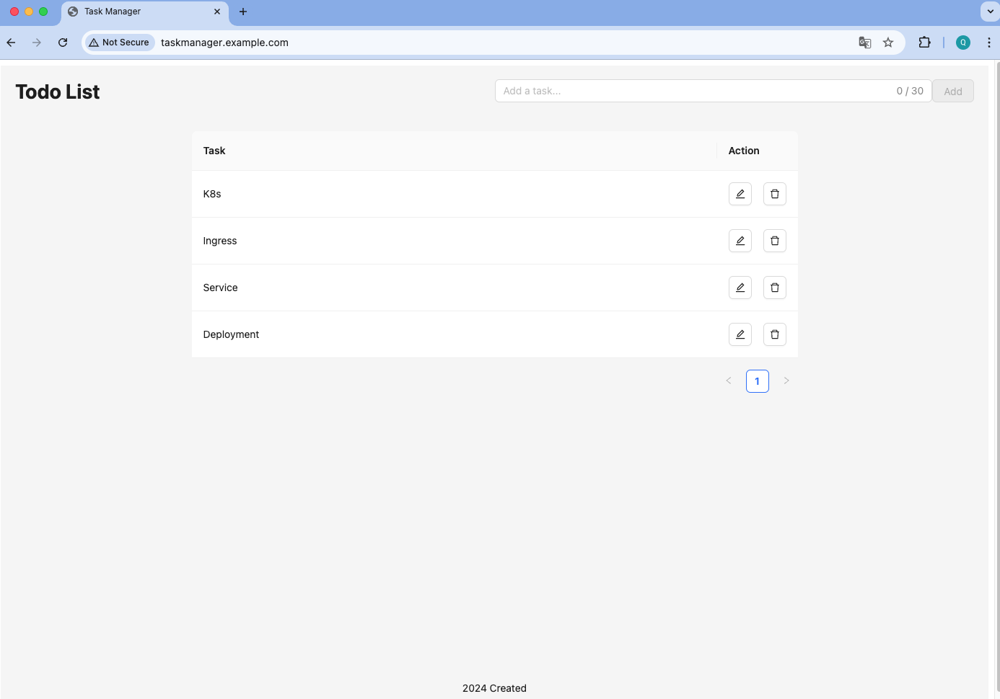

# Task App

A modern React single-page application built with Webpack and Docker for streamlined development and deployment. The frontend is powered by Ant Design, Axios, and React Router, with Nginx serving as a proxy to deliver a clean, efficient, and scalable user experience.  

The backend is a robust Express.js application connected to MongoDB and managed with PM2 to ensure stability, scalability, and process management. The entire application is containerized using Docker and orchestrated with Docker Compose for easy deployment and scalability.  

Additionally, for scalable and resilient production environments, the app can be deployed and managed using Kubernetes, allowing for efficient orchestration and management of containerized services.

## Technologies Used

#### Frontend Technologies

React.js: Used for building the front-end user interface.  
Ant Design: Provides modern and responsive UI components.  
Axios: Simplifies making HTTP requests.  
Babel: Transpiles modern JavaScript for browser compatibility.  
Webpack: Bundles and optimizes JavaScript, CSS, and HTML files.  
ESLint: Enforces consistent code style and detects errors.  
Prettier: Automatically formats the codebase for readability and consistency.  
Nginx: Acts as a proxy server for the front end.  
Docker: Containerizes the front-end application for deployment.  

#### Backend Technologies

Express.js: Used to create a RESTful API for handling requests.  
MongoDB: NoSQL database for data storage and management.  
PM2: Process manager for managing application instances.  
Nginx: Acts as a reverse proxy for back-end services.  
Docker: Containerizes the back-end application for deployment.  
Docker Compose: Orchestrates multi-container Docker applications, including Express, MongoDB, and Nginx.  

## Application Overview

This application allows users to create, manage, and track tasks in a simple, efficient interface.



## Frontend Installation

1. Install dependencies:

    ```bash
    npm install
    ```

2. Set up the environment:

    * Create a .env file
    * Configure environment variables

3. Available scripts:

    * Start the development server

        ```bash
        npm start
        ```

    * Build for production and serve

        ```bash
        npm run build
        npm run serve
        ```

    * Build and push Docker image to Docker Hub

        ```bash
        npm run deploy
        ```

    * Run the Docker container to serve the webpage with Nginx

        ```bash
        npm run launch
        ```

## Backend Installation

1. Install dependencies:

    ```bash
    npm install
    ```

2. Set up the environment:

    * Create a .env file
    * Configure environment variables

3. Available scripts:

    * Start the server using PM2

        ```bash
        npm start
        ```

    * Start the development server with Nodemon

        ```bash
        npm run dev
        ```

    * Build and push Docker image to Docker Hub:

        ```bash
        npm run deploy
        ```

    * Run the application with Docker Compose

        ```bash
        docker-compose up --build
        ```

        Rebuilds images if there have been any changes in the Dockerfiles or dependencies. Launches all services defined in the docker-compose.yml file (including MongoDB and Nginx). Attach logs to monitor the output from all containers in real-time.  

        ---
        **_Alternatively:_**  Create a Docker network, run the Express app and MongoDB containers, and connect them to the network manually if needed.

## Kubernetes (Minikube)

- Deployments: Manages stateless applications.  
- StatefulSet: Manages stateful applications.  
- Services: Exposes and load-balances traffic to Pods.  
- ConfigMaps: Stores non-sensitive configuration data.    
- Secrets: Stores sensitive data.  
- Ingress: Manages external HTTP access to services within the cluster.  

1. Apply the YAML configuration

    ```bash
    kubectl apply -f K8s/
    ```

2. Edit the /etc/hosts file and run Minikube tunnel

    ```bash
    minikube tunnel
    ```

## Reference

Express.js: https://expressjs.com/en/4x/api.html#express  
MongoDB: https://www.mongodb.com/docs/manual/reference/command/ping/  
PM2: https://pm2.keymetrics.io/docs/usage/quick-start/  
Docker: https://docs.docker.com/reference/cli/docker/  
Docker Compose: https://docs.docker.com/reference/cli/docker/compose/up/  
Nginx: https://www.youtube.com/watch?v=q8OleYuqntY  
React.js: https://react.dev/reference/react/Suspense  
React Hooks: https://www.w3schools.com/react/react_hooks.asp  
Webpack: https://webpack.js.org/configuration/entry-context/  
Ant Design: https://ant.design/components/overview  
Axios: https://axios-http.com/docs/interceptors  
Babel: https://babeljs.io/docs/presets  
Eslint: https://eslint.org/docs/latest/rules/  
Prettier: https://prettier.io/docs/en/options  
Kubernetes: https://www.youtube.com/watch?v=X48VuDVv0do  
Ingress: https://kubernetes.io/docs/tasks/access-application-cluster/ingress-minikube/  